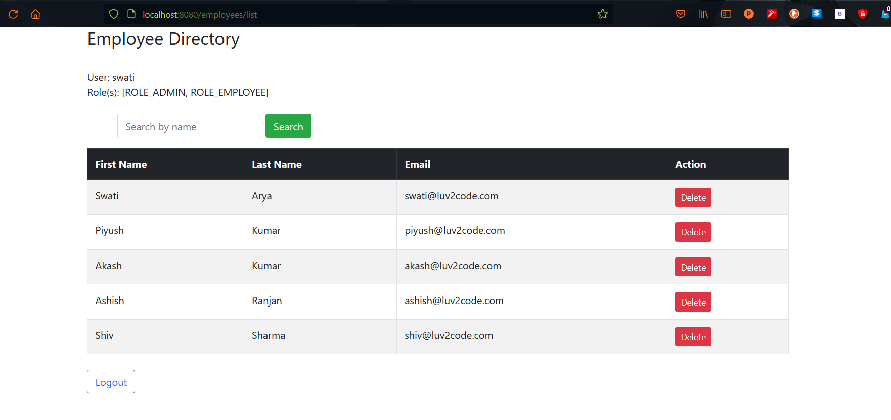
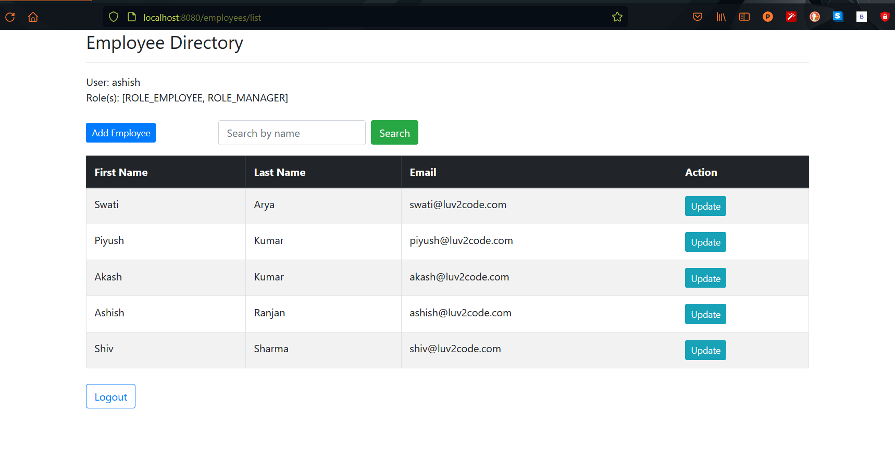

# <code>Customer Relationship Management Project</code>

[See Dependency Tree](https://github.com/piyush168713/thymeleafdemo-employees-crm-security-project/blob/master/pom.xml)

## <code>Key Features</code>

### CRUD
### Sorting
### Logging Support
### Searching by name
### User Authentication based on roles
  

Screenshots :

  
 

